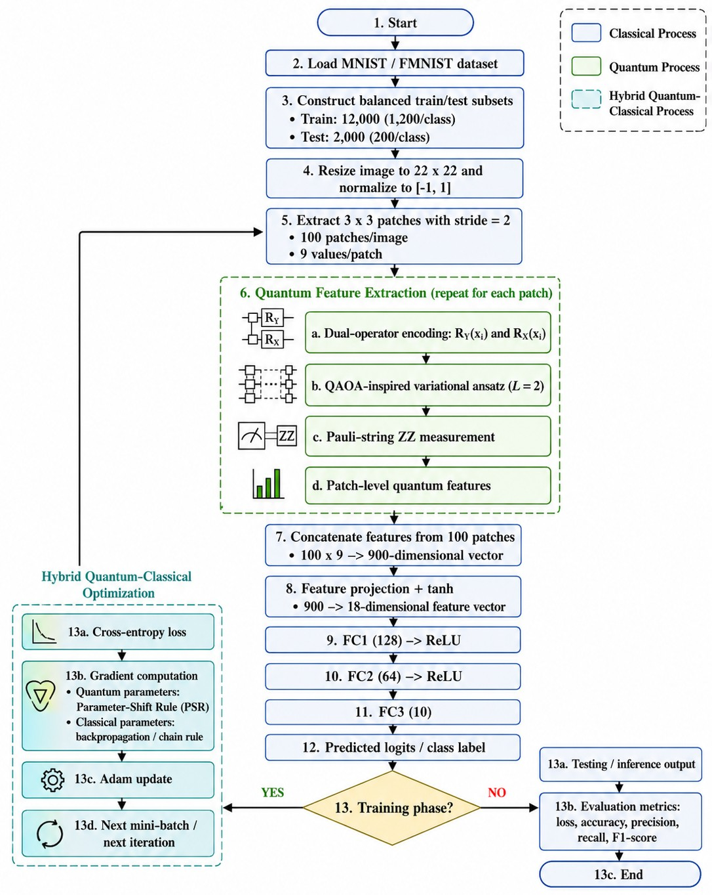

# QIFE Image Classification

QIFE
[](https://colab.research.google.com/github/vanbabenk/QIFE-Image-Classification/blob/main/notebooks/01_QIFE_MNIST.ipynb)

QFE
[](https://colab.research.google.com/github/vanbabenk/QIFE-Image-Classification/blob/main/notebooks/02_QFE_Baseline_MNIST.ipynb)

CNN
[](https://colab.research.google.com/github/vanbabenk/QIFE-Image-Classification/blob/main/notebooks/03_CNN_Baseline_MNIST.ipynb)

This repository provides Jupyter Notebook implementations for **Quantum Inspired Feature Extraction (QIFE)** and related baselines for image classification experiments.

The repository is intended as a reproducibility companion for the manuscript:

> **QIFE: A Novel Efficient Quantum Feature Extraction for Convolution Deep Learning based Classification**

## Methods

The repository includes three experiment notebooks:

| Method | Notebook | Description |
|---|---|---|
| QIFE | `notebooks/01_QIFE_MNIST.ipynb` | Proposed quantum-inspired feature extraction using dual-operator encoding and Pauli-string ZZ measurements. |
| QFE | `notebooks/02_QFE_Baseline_MNIST.ipynb` | Quantum Feature Extraction baseline. |
| CNN | `notebooks/03_CNN_Baseline_MNIST.ipynb` | Lightweight classical convolutional neural network baseline. |

## Repository structure

```text
QIFE-Image-Classification/
├── notebooks/
│   ├── 01_QIFE_MNIST.ipynb
│   ├── 02_QFE_Baseline_MNIST.ipynb
│   └── 03_CNN_Baseline_MNIST.ipynb
├── docs/
│   ├── figures/
│   │   └── qife_flowchart.png
│   ├── reproducibility.md
│   └── paper-traceability.md
├── results/
│   └── README.md
├── configs/
│   └── mnist_experiment_config.json
├── requirements.txt
├── requirements-colab.txt
├── .gitignore
├── CITATION.cff
├── LICENSE
└── README.md
```

## Method flowchart



## Execution environment

The notebooks are designed primarily for **Google Colab**.

To reproduce an experiment:

1. Click one of the **Open in Colab** badges above.
2. In Colab, select **Runtime → Disconnect and delete runtime**.
3. Select **Runtime → Run all**.
4. Confirm that the dataset is downloaded automatically and the final metrics are displayed.

No private Google Drive folder is required.

## Local installation

The recommended execution platform is Google Colab. However, the notebooks may also be executed locally using JupyterLab.

```bash
python -m venv .venv
source .venv/bin/activate
pip install -r requirements.txt
jupyter lab
```

For Windows PowerShell:

```powershell
py -m venv .venv
.venv\Scripts\activate
python -m pip install -r requirements.txt
jupyter lab
```

## Dataset protocol

The uploaded notebooks currently reproduce the **MNIST** experiments.

The experiment protocol follows:

- Dataset: MNIST
- Classes: 10
- Image size: 22 × 22
- Normalization: [-1, 1] for quantum-feature pipelines
- Patch size: 3 × 3
- Patch stride: 2
- Number of patches per image: 100
- Patch values: 9 values per patch
- Balanced training subset: 12,000 images, 1,200 images per class
- Balanced testing subset: 2,000 images, 200 images per class

## Outputs

The notebooks report:

- Test loss
- Accuracy
- Precision
- Recall
- F1-score
- AUC, when available
- Confusion matrix
- Training/runtime information


## Important reproducibility note

The current notebooks use a quantum simulator through PennyLane. They do not represent execution on a real quantum processing unit.

Runtime and numerical values may vary slightly across Colab sessions because GPU availability and package versions can vary.


## Citation

If you use this repository, please cite the corresponding manuscript and repository release.

```bibtex
@software{mahargya_qife_image_classification,
  author = {Mahargya, Ifran Lindu},
  title = {QIFE Image Classification},
  url = {https://github.com/vanbabenk/QIFE-Image-Classification},
  version = {1.0.0},
  year = {2026}
}
```

## License

This repository is released under the MIT License.
